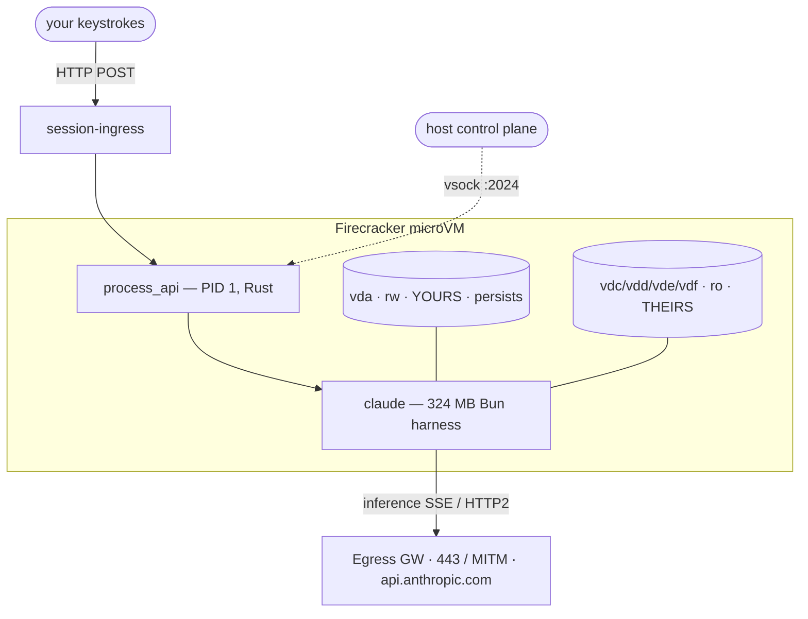
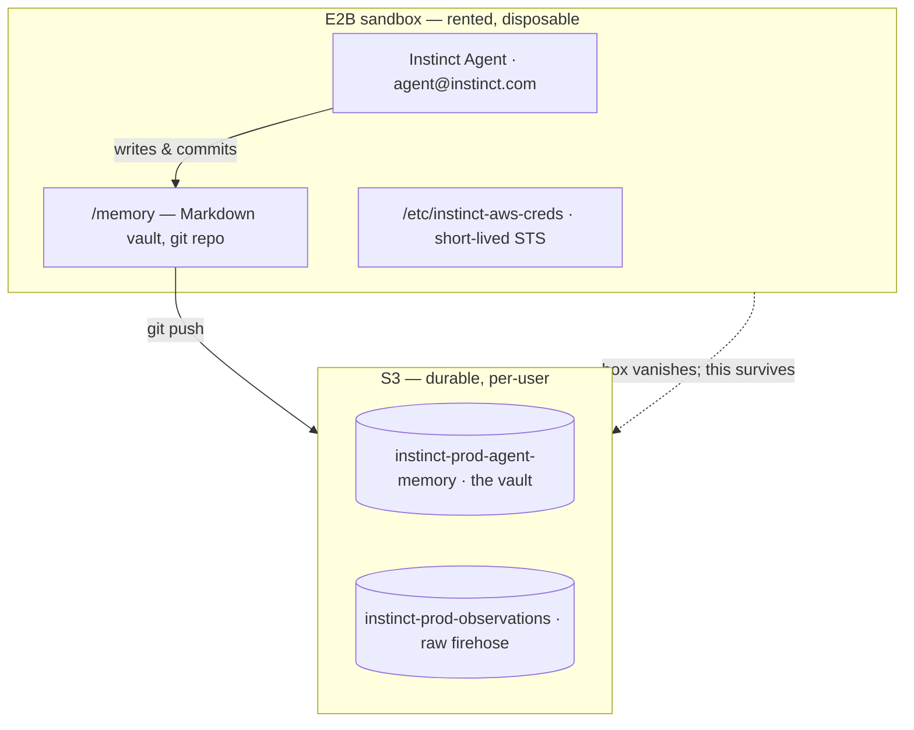
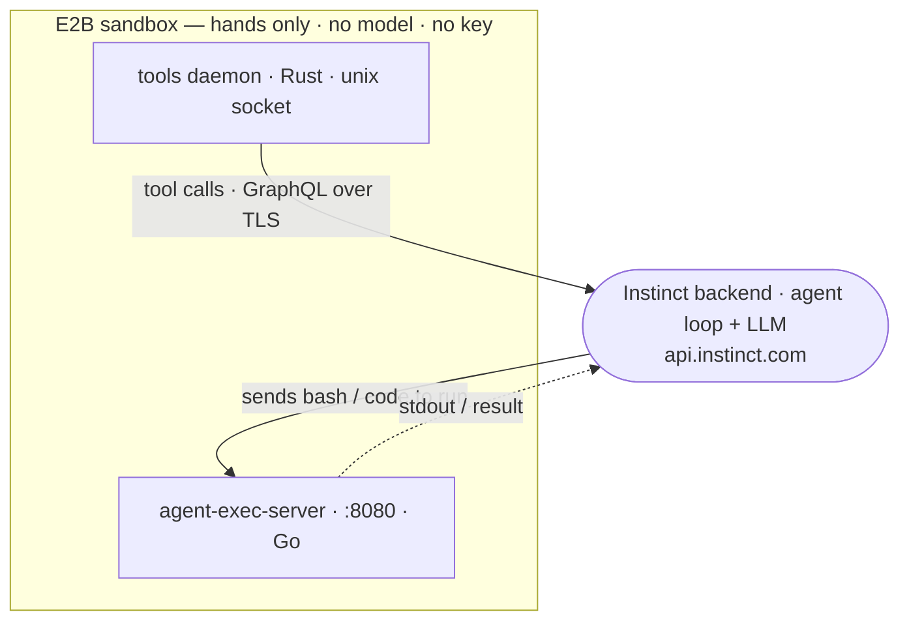

# The box an agent runs in 

One awesome product evolution is that agents are moving off our local computers so that you can use them from your phone.
However this comes with its own set of challenges because this means they need their own VMs.
Ultimately this is great for the customer because that means the agent companies provide us with VMs to use! Here's a tour of how the major platforms work based on poking around with [ws-term](https://github.com/RohanAdwankar/ws-term).

## Claude Code on Your Phone

Claude Code's box is its own **Firecracker microVM** a KVM guest with its
own kernel, booted straight into an init written in Rust:

```
$ cat /proc/cmdline
... rdinit=/process_api ... --listen-vsock-port 2024
$ uname -r
6.18.5-fc-v20                 # -fc- = Firecracker; a custom-built guest kernel
$ ps -o comm -p 1
process_api                   # PID 1 is not systemd — it's a Rust/Tokio binary
```

`process_api` is the whole story. It's PID 1 *and* the host's control agent living
inside your VM: it mounts the disks, then listens on **vsock port 2024** so the
host can drive the session from outside. That's the platform's defining trait —
**the operator lives inside your tenant space**, and a lot of engineering goes into
sealing it off (PID 1 is non-dumpable, `/proc/1/mem` is denied even with
`CAP_SYS_PTRACE`, your shell is missing `CAP_SYS_RESOURCE`).

The disks split cleanly into *yours* (writable, persistent) and *theirs*
(read-only, shared):

```
$ lsblk -o NAME,SIZE,RO,MOUNTPOINT
vda   256G  0  /                    # yours: writable, survives reclaim
vdc   341M  1  /opt/claude-code     # theirs: the 324 MB `claude` harness (Bun)
vdd  45.6M  1  /opt/env-runner      # theirs: the task launcher
vde/vdf ... 1  /mnt/skills/...      # theirs: skills
```

The **harness** — the thing running your tool calls — is a 324 MB compiled Bun
binary on a read-only disk. The **model** runs somewhere else entirely; the box
has no GPU. Inference goes out as **Server-Sent Events over HTTPS/2** (not a
WebSocket) to `/v1/messages`, through an egress gateway that is 443-only and
MITM'd (`CN = Egress Gateway ... (production)`), with `api.anthropic.com` pinned
in `/etc/hosts`. There is no inbound at all (`192.0.2.2`, an RFC-5737 test
address). Auth is a **host-minted OAuth token**, cached root-only on disk and
rotated per boot.

Lifecycle is host-driven and measured from the inside: **~430 ms** to init,
**~6.4 s** to the harness process. Spin-up is triggered by an inbound message
(the host wakes the VM over vsock and runs `--session-mode resume`); spin-down is
idle reclaim decided by the host. When it's reclaimed, the *processes* die but
`vda` detaches intact and reattaches on the next cold boot — which is why the
conversation feels continuous even though the compute was destroyed.



*Durable thing = the machine (`vda`). The operator lives inside the VM, sealed.*

**The bet:** the *machine* is durable. Keep your disk, cold-boot fresh compute
around it, and put the operator inside the guest but wall it off.

---

## Instinct

Instinct is a new startup which launched recently and it does some very nice things on the memory side which gives that feel of it being a real assistant rather than a chatbot.

```
$ hostname
e2b.local
$ cat /.e2b
n038afjvewg7jnc9pwdz
```

Instinct doesn't run its own hypervisor. `e2b.local` means this is a rented
[E2B](https://e2b.dev) sandbox — "sandbox-as-a-service," a throwaway Ubuntu box
you hand an agent so it has a computer. The `.e2b` file is the template it was
cloned from. The box is deliberately forgettable:

```
Ubuntu 22.04.5 · 2 vCPU · 1.9 GB RAM · 29 GB disk · up ~30 min · user sandbox (uid 1001)
```

So if the box is disposable, where does the agent's memory live? In a directory
called `/memory` — and this is the platform's defining idea:

```
$ cat /memory/README.md
Persistent memory for [[rohan-adwankar]]
$ ls /memory
entities/  comms/  timeline/  workstreams/  knowledge/
$ git -C /memory log --format='%an <%ae>' -1
Instinct Agent <agent@instinct.com>
```

The agent's memory is a **git repo of Markdown files** with `[[wiki-links]]`,
navigated by `grep`. The `timeline/` *coarsens* over time (raw → hourly → daily →
weekly, like human memory), and the agent is literally the **git author** — it
doesn't call a memory API, it writes Markdown and commits it as itself.

The durable layer is that repo, pushed to **S3**, keyed by a per-user id — and
stored not as files but as a single **git bundle**, which is a great little gotcha:

```
$ git -C /memory remote -v
origin  s3://instinct-prod-agent-memory/filesystem-memory/user-01M1VW7...
$ aws s3 ls s3://.../user-01M1VW7.../ --recursive
  HEAD
  refs/heads/main/<sha>.bundle     # the ENTIRE vault, packed — `ls` after sync looks empty
```

Auth is **short-lived STS credentials**, not long-lived keys — so a leaked
sandbox self-heals when the token lapses:

```
$ cat /etc/instinct-aws-creds
export AWS_ACCESS_KEY_ID='ASIA…'     # ASIA prefix + session token = temporary STS
...                                   # (values redacted — live secrets)
# role: instinct-sandbox-observations-role
```



*Durable thing = a git repo in S3. The machine is throwaway.*

**The bet:** the *machine* is disposable. Move all durability into a per-user git
repo in S3, and let each box be a fresh clone that dies without loss.

Using a git repo for this is quite nice the default structure seems to be like this:
```
  ~/instinct-vault/..         │󰫎  24 󰲡 Vault
    .git                    │   23
    comms                   │   22 Persistent memory for 󱗖 rohan-adwankar. Markdown + wiki-links, navigated by grep. Start here, then jump
      chat                  │   21
         rohan-adwankar--inst│   20 Who Rohan is, what he is working on, and what is connected live in entities/, workstreams/, and knowled
    entities                │   19
      people                │󰫎  18  󰲣 Layout
         rohan-adwankar.md   │   17
      projects              │   15 README.md
         ws-term.md          │   14 timeline/     chronological record, coarsening upward: raw/ → hourly/ → daily/ → weekly/ → monthly/
    knowledge               │   13 entities/     people/ projects/ — the nouns of Rohan's world, one file each
      decisions             │   12 comms/        chat/ email/ meetings/ — one file per thread, named <who>--<topic>--<date>.md
         x-account-signup-dec│   11 workstreams/  active/ completed/ someday/ — units of work; status: frontmatter matches the subdirectory
      preferences           │   10 knowledge/    facts/ procedures/ preferences/ decisions/
        instinct            │    8
           autonomy.md       │    7 knowledge/preferences/instinct/ holds how Rohan wants the assistant itself to behave — autonomy, drafti
           iteration-style.md│    6
    timeline                │󰫎   5  󰲣 Conventions
      daily                 │    4
         2026-09-06.md       │    3 ● Every file has frontmatter with id, type, and aliases. [[id]] resolves to id.md or id/_index.md.
    workstreams             │    2 ● Entity and knowledge files are updated in place and read as current state, never as a log. History li
      active                │    1 ● Files that outgrow one page are promoted to a directory with an _index.md carrying the original id.
         dragon-game-asset.md│  25  - Timeline and comms hold events and conversations; entities hold durable properties only.
         startup-idea-search.│~
    󰂺 README.md               │~
~                             │~
~                             │~
~                             │~
~                             │~
~                             │~
~                             │~
~                             │~

:!tmux capture-pane -pS - | pbcopy
```


### What harness, and how does it call the model?

```
$ ps -eo args | grep -E 'agent-exec|tools'
agent-exec-server --port 8080                    # Go — runs the bash/code it's sent
tools __internal_daemon --socket /tmp/.tools/bridge.sock \
      --base-url https://api.instinct.com/-/api/graphql/tool-execute   # Rust
$ strings /usr/local/bin/tools /usr/local/bin/agent-exec-server \
    | grep -iE 'anthropic|openai|/v1/messages|x-api-key|claude|gpt|model'
                                                 # → nothing. no model, no key, no endpoint.
```

There is no inference call anywhere on the box. Claude Code seals the *operator*
inside the guest; Instinct doesn't put the brain in the guest at all. The sandbox
is a pure **execution surface**: `agent-exec-server` runs whatever bash the backend
hands it, and every tool call — Gmail, the cloud browser, a payment — leaves as a
**GraphQL request to `api.instinct.com`**, executed server-side. The `--base-url`
is a runtime argument, not compiled in.



So the contrast sharpens: Claude Code keeps the **harness** on the box and sends
only *inference* out; Instinct sends **both the harness and the model** out and
keeps only hands on the box. Which is exactly the durability bet, one layer up —
if the machine is disposable, you don't leave anything worth keeping on it,
including the thing doing the thinking. The one fact the box genuinely can't tell
you is *which* model — because it is never told.

---

## Summary

| | **Claude Code** | **Instinct** |
|---|---|---|
| Isolation primitive | Own Firecracker microVM | Rented E2B sandbox |
| Who runs the hypervisor | The platform | E2B (third party) |
| What's durable | The machine (`vda` block volume) | A git repo in S3 |
| Memory model | Conversation state on disk | Markdown vault, git-versioned, agent-authored |
| Credentials | Host-minted OAuth, on disk, rotated | Short-lived STS, role-scoped |
| Backing store | Local virtio-block | S3, keyed by per-user id |
| Harness location | On the box — 324 MB Bun binary | Off the box — backend only; the box holds two execution shims |
| How the model is reached | SSE → `/v1/messages` via egress gateway | Never from the box — GraphQL to `api.instinct.com`, server-side |
| Operator in tenant space | Yes — `process_api` over vsock | No — brain *and* harness run off-box |
| Boot cost (measured) | ~430 ms init, ~6.4 s to harness | fresh clone of a stock template |


This was pretty fun to take a peak, I'll keep recording my notes down as new platforms come around! 
