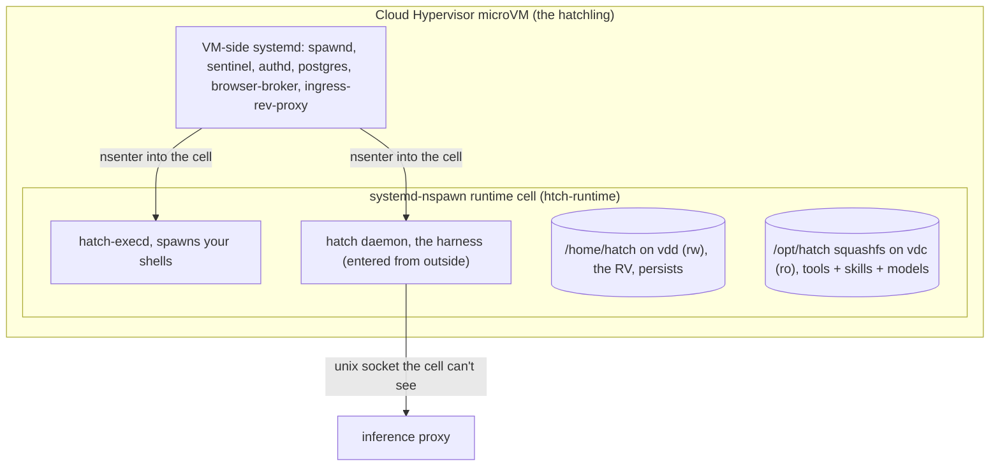
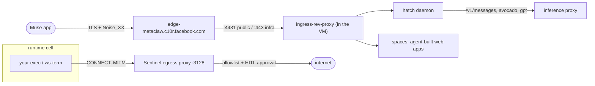

# why is muse so fast?

This is a follow up to a post on [on agent sandboxes](https://rohanadwankar.github.io/posts/platforms.html).

Last time as one commentator wrote (its firecracker all the way down)[https://news.ycombinator.com/item?id=49605644#:~:text=It%27s%20always%2C%20firecracker%20all%20the%20way%20down!], but lucky for us a day later Meta launched Muse to add some diversity and a new VM to explore!

As part of the launch one of the bold claims was that Muse is the faster alternative to some of their competition which was covered last time. So lets look under the hood and see what they have been up to. Like last time we will do this by dialing a shell out through [ws-term](https://github.com/RohanAdwankar/ws-term) and looking around with the usual tools.

Right of the bat the first thing you notice is that `systemd-detect-virt` and the DMI table
disagree about what kind of machine this is, and both are right:

```
$ systemd-detect-virt
systemd-nspawn
$ cat /sys/class/dmi/id/product_name
cloud-hypervisor
$ uname -r
7.0.0-26-generic                    # a stock Ubuntu kernel, not a custom build
$ hostname; id
htch-runtime
uid=0(root) gid=0(root) groups=0(root)
```

So the shell is root inside a **systemd-nspawn container**, and that container is
running inside a VM whose DMI vendor, product, and BIOS strings all read [Cloud
Hypervisor](https://github.com/cloud-hypervisor/cloud-hypervisor). The container shares the VM's kernel, which is why it's a plain
Ubuntu `-generic` kernel rather than the `-fc-` custom build Claude Code boots.


## Not Firecracker

```
$ cat /sys/class/dmi/id/sys_vendor /sys/class/dmi/id/product_name /sys/class/dmi/id/bios_version
Cloud Hypervisor
cloud-hypervisor
0
$ cat /proc/cmdline
console=ttyS0 root=/dev/vda rootfstype=btrfs ip=dhcp ds=nocloud;s=http://169.254.169.254/latest/
  lsm=landlock,lockdown,yama,integrity,apparmor,bpf ro
  systemd.set_credential=vmm.notify_socket:vsock-stream:2:512
```

Cloud Hypervisor and Firecracker are siblings: both Rust VMMs on KVM built on the same
`rust-vmm` crates. Firecracker came out of AWS Lambda and is deliberately tiny;
Cloud Hypervisor came out of Intel, now lives at the Linux Foundation, and is the
"grown-up" one. The differences that matter for a product like this:

| | Firecracker | Cloud Hypervisor |
|---|---|---|
| Origin | AWS (Lambda, Fargate) | Intel, now Linux Foundation |
| Bus | virtio over MMIO only, `pci=off` | Full PCI, virtio-pci |
| SMBIOS/DMI | none (empty `product_name`) | present, vendor string "Cloud Hypervisor" |
| Hotplug | no | vCPU, memory, disk, NIC hotplug |
| Devices | block, net, vsock, balloon | + vhost-user, virtio-fs, virtio-pmem, TPM, GPU passthrough |
| Boot | direct kernel only | direct kernel or firmware (UEFI/OVMF) |
| Snapshot/restore | yes | yes |
| Sandbox | its own `jailer` | seccomp, expects an external sandbox |

Muse wants the right column: the guest has four virtio-block disks it can swap
(`vda` root, `vdb` overlay, `vdc` the hatch image, `vdd` the 100 GB user volume), a
vsock notify channel back to the VMM, and later a *browser VM* that gets leased in per
task. Both E2B and Claude Code showed the Firecracker signature last time (`pci=off`,
empty DMI, `virtio_mmio.device=`). This one has a PCI bus and a BIOS string.

## The two boxes

```
$ lsblk -o NAME,SIZE
vda    7.3G       # VM root, btrfs, read-only (ro on the cmdline)
vdb    7.5G       # overlay upper: the writable scratch layer for /
vdc    587M       # the "hatch image": daemon, tools, models, squashfs + verity
vdd    100G       # yours: the RV, btrfs, mounted at /home/hatch
$ df -h | grep -vE tmpfs
overlay         7.5G   17M  7.5G   1% /
/dev/mapper/rv  100G  111M   99G   1% /home/hatch
```

The split is the same idea as Claude Code's *yours vs theirs* disks, but with a
container drawn around it:



The VM-side services and the cell share a PID namespace but not a mount namespace.
`hatch daemon` and `hatch-execd` show up in `ps` inside the cell with **PPID 0**: they
were started on the VM and `nsenter`ed in. Even as cell root you cannot read
`/proc/<daemon>/ns/*` or `/proc/<daemon>/root`. That's the same trick as Claude Code's
sealed `process_api`, except the operator process lives *next to* your tenant
namespace instead of being PID 1 of it.

```
$ ps -eo pid,ppid,cmd | head -5
    1     0 /usr/lib/systemd/systemd
   17     1 /usr/lib/systemd/systemd-journald
 1347     0 /opt/hatch/bin/hatch-execd --runtime-cell-leader=1957    # PPID 0: entered from the VM
 1586     0 /opt/hatch/bin/hatch daemon --runtime-cell-leader=1957
$ readlink /proc/1586/ns/mnt
                                                                     # (empty: not yours to see)
$ ls /run/hatch/
auth  cell-anchors  egress-tls  egress-tz  noded  privsep  resume  runtime-cell  sandbox  sandbox-api  telemetry
                                                                     # no proxy/, no daemon/: inference socket is not in the cell's view
```

Even your tool shells are isolated from each other: my bash was in a different mount
namespace from the cell's PID 1. Every `exec` the agent runs gets its own view.

## So why is it fast?

Because the machine you talk to was already running before you needed it, and
"your" part of it is just a disk that gets attached. The scripts in
`/opt/hatch/runtime-cell/` and `/opt/hatch-image/bin/` spell it out.

**1. The VM boots with no identity.** `hatch-prewarm` runs "after hatch-init, before
any RV attach" and describes the cell boot files as *"identityless preboot."* Meanwhile
the env carries `JARVIS_IS_ASSIGNED=0`. The VM comes up as a generic hatchling and
waits.

**2. Your data is a volume, not a machine.** `vdd` is the *RV*, which one script
expands as "Reliable Volume": a 100 GB btrfs volume (`compress-force=zstd:3`,
`discard=async`) holding `/home/hatch`, `/var/lib/hatch`, and the on-VM Postgres data.
Attaching you to a hatchling is `spawnd rv-graft`:

```
rv-graft   Graft RV identity onto the pre-booted runtime: verify the RV binds,
           superficially validate the resume handoff marker, ensure the os-intent
           ledger dir, and write the boot-id-stamped /hatch/data/resume/rv-identity-ready
```

**3. Nothing is installed at boot.** The VM root is read-only btrfs built with mkosi;
`/opt/hatch` is a squashfs on dm-verity (the prewarm script calls it the
"measured rootfs"); the cell's rootfs is reconciled against a KDL manifest
(`runtime-cell.kdl`: ~110 apt packages, from `build-essential` to
`libreoffice-*-nogui`, `tigervnc`, `xvfb`, `cloudflared`, `nodejs 24`) and the distro's
own `apt-daily`/`unattended-upgrades` timers are *retired* with inert unit overrides so
nothing phones home unattributed. Packages the agent installs are recorded as intent in
an append-only ledger on the RV and replayed, not persisted in the rootfs.

**4. The page cache is pre-warmed.** Before the RV attaches, `vmtouch -t` touches the
Postgres server and its `ldd` closure, the hatch daemon binary, `systemd-nspawn`'s
closure, and the cell's init/loader/libc, under a 256 MiB budget with a 10 s
self-deadline, "fail-open everywhere." A health gate requires `is-system-running`
to be exactly `running` before a VM is eligible, so nothing in this path is allowed to
fail a unit.

**5. The cell's boot target is nearly empty.**

```
$ systemctl list-units --type=service --state=running
  systemd-journald.service          # that's it
$ systemd-analyze
Startup finished in 2.212s (userspace)
default.target reached after 213ms in userspace
```

`default.target` is a custom unit whose only `Wants=` is `hatch-execd.socket`.
Everything else (Postgres, Sentinel, authd, telemetry, the browser broker) lives on the
VM side and is bind-mounted in as Unix sockets.

**6. The harness ships separately from the OS.** `hatch --version` printed a commit
built at `2026-09-11T02:29:54Z`, about two hours before I read it, on
`JARVIS_CD_CHANNEL=alpha`. The daemon is a "live-update bundle" with its own trust
root (the prewarm script refuses to `ldd` it for that reason), so shipping a new
harness does not mean shipping a new VM image.

### Watching it happen

I got lucky. Around 21:14 my shell dropped, the redial loop reconnected, and the box
had a different boot time:

```
$ grep btime /proc/stat          # before: 1789094439 (19:40:39)
btime 1789100040                 # after:  21:14:00
$ journalctl | grep "Startup finished"
Sep 10 21:14:13 htch-runtime systemd[1]: Startup finished in 2.307s.
$ cat /run/hatch/resume/rv-identity-ready
6c7da3cc-... 2026-09-11T04:14:21.732Z marker=present
$ cat /run/hatch/resume/execution-ready.marker
2026-09-11T04:14:39.110151343+00:00
```

| Stage | Wall clock | Since kernel boot |
|---|---|---|
| Kernel boot (`btime`) | 21:14:00 | 0 s |
| Cell `default.target` | 21:14:13 | 13 s |
| RV grafted, identity known | 21:14:21 | 21 s |
| Second CA refresh (identity-specific anchors published) | 21:14:35 | 35 s |
| `execution-ready` marker | 21:14:39 | 39 s |

So a *cold* replacement is ~40 s end to end, but in the steady state the first 13 s
have already happened on a spare hatchling before you show up. The interesting
number is the 18 s between graft and execution-ready, which is presumably the
Postgres bring-up plus the daemon resuming sessions off the RV. My home directory
came back with every file intact and the same timestamps, because none of it lived
on the VM.

Why did it get replaced at all? `/usr/sbin/reboot` is overwritten with a script
that explains the policy:

```
# A hatchling cannot reboot in place. The VMM does not survive a guest reset:
# the VM disappears, the hatchling goes UNHEALTHY, and the workflow recovers by
# REPLACING it with a brand new VM. That was measured, not assumed ...
# So `reboot` already means "replace this VM" ... Powering off reaches the same
# end state with services stopped in order.
```

Reboot is replace. Upgrade is replace ("package freshness rides the reconcile plus
VM replacement"). Crash is replace. The VM is cattle and the RV is the pet.

## What is metaaivm.com?

Every hatchling has a public name:

```
JARVIS_FQDN=70f9aa6e-1767-497b-96fd-6bbac24fe79b.metaaivm.com
$ dig +short 70f9aa6e-....metaaivm.com
edge-metaclaw.c10r.facebook.com.
57.144.221.192
$ host 57.144.221.192
... edge-metaclaw-shv-01-sjc6.facebook.com.     # a Meta PoP in San Jose, closest to me
$ whois metaaivm.com | grep -E 'Creation|Name Server' | head -2
Creation Date: 2026-02-26
Name Server: A.NS.FACEBOOK.COM
```

The per-VM hostname is a CNAME into Meta's edge (`c10r` is their edge tier; the domain
was registered this February). Behind it, *inside the VM*, is `ingress-rev-proxy`, an
"Internet-facing ingress reverse proxy with Noise_XX encryption": `:443` for infra
(`health`, `version`, `journal`, `rescue`, `yolk`) and `:4431` for the public data
plane (`ping`, `v1/noise`, `spaces`). From my laptop, 443 accepts the TCP connection and
then resets the TLS ClientHello, and 4431 isn't exposed at the edge at all. Without the
Noise handshake the edge has nothing to forward. The `hatch-ws-client` tool has a
`noise` subcommand for exactly this path.

This is the biggest architectural difference from last time. Claude Code's VM has
**no inbound at all**; Instinct's E2B box is only reachable by the backend. Muse's VM
is a **server with a DNS name**. The phone app talks to your VM through Meta's edge,
and `spaces` (a route on the public listener, with a `space.json` build format in the
daemon's strings and four `space-*.sock` sandboxes in `/run/hatch/sandbox/`) are web
apps the agent builds and serves *from your VM*.



## Egress: fake IPs and a MITM

The cell has one veth with a /30 and a gateway that is also the DNS server and the
proxy:

```
$ ip -br a
host0@if3  UP  198.19.0.2/30  fd8b:4f84:7d32:99::2/64
$ grep -v '^#' /etc/hosts | tail -2
198.19.0.1 hatch-egress-proxy
fd8b:4f84:7d32:99::1 hatch-egress-proxy
$ env | grep -i proxy
HTTPS_PROXY=http://hatch-runtime:<rotated-per-boot>@hatch-egress-proxy:3128
NO_PROXY=localhost,127.0.0.1,::1,198.19.0.1,198.19.0.2,...
CURL_CA_BUNDLE=/run/hatch/egress-tls/ca-bundle.pem      # also GIT_SSL_CAINFO, NODE_EXTRA_CA_CERTS, AWS_CA_BUNDLE
```

What happens when you try to get around it:

```
$ dig +short @8.8.8.8 example.com
198.18.123.158                       # not example.com: a fake IP from the 198.18/15 bench range
$ curl https://1.1.1.1/              # direct 443, no proxy
curl: (35) ... SSL connect error     # TCP is answered, TLS is not: the gate ate it
$ curl -sv https://example.com/ 2>&1 | grep -E 'issuer|Connection Established'
< HTTP/1.1 200 Connection Established
*  issuer: CN=Hatch Sandbox Egress CA; O=Hatch          # MITM'd, like Claude Code's egress gateway
$ curl https://example.com:8443/     # non-standard port
< HTTP/1.1 200 Connection Established
curl: (28) Operation timed out       # CONNECT accepted, then held. That's the approval queue.
```

DNS is answered by the gateway with synthetic addresses so that every connection can
be attributed to a *name* at the proxy, and the `pre-start.sh` script attaches an
eBPF `connect4`/`connect6` cgroup hook (`spawnd attach-cell-gate`) as "the floor UNDER
Sentinel: with `BPF_F_ALLOW_MULTI`-composed cgroup hooks every program must allow, so a
dead/held-down Sentinel no longer means ungoverned link-local/RFC1918/CGNAT reach."
There's a second classifier on the VM side of the veth that drops frames aimed at
host-local destinations. Sentinel itself is the policy engine: an allowlist plus a
human-in-the-loop approval socket (`JARVIS_EGRESS_APPROVAL_*`). The proxy password and
the CA bundle both rotated when the VM was replaced, and a `hatch-ca-trust.path` unit
watches for rotation.

The one thing the box never sees is an inference endpoint: `api.anthropic.com` returned
a 404 through the proxy (reachable, but there's no key anywhere in the cell, and the
daemon's inference socket isn't mounted here).

## Where the brain is

The harness is `hatch daemon`, a Rust binary (`hatch 0.1.0 (17400c3e011)`), and it is
noticeably model-agnostic:

```
$ strings /opt/hatch/bin/hatch | grep -oE '(claude|avocado|gpt)-[a-z0-9.-]+' | sort | uniq -c | sort -rn | head
  3 avocado-5.16-v4          # internal model family, also "avocado-memory-flush-v1"
  2 claude-opus-4-6
  2 claude-opus-4-8
  1 claude-sonnet-4-6
  1 gpt-5.6-sol
  1 gpt-5.5-codex
$ strings /opt/hatch/bin/hatch | grep -c anthropic     # "failed to parse anthropic response", "/v1/messages"
```

Plus classifier names (`9b_safety_classifier`, `2b_tool_call_classifier_v0_4`,
`pi_3b_prefilter`) and a "Gatekeeper" call at `localhost/hatch/check_gatekeepers`.
Inference leaves the daemon over `JARVIS_INFERENCE_PROXY_SOCK`, a Unix socket the cell
cannot reach, so the model provider is a server-side routing decision.

Some models are on the box though:

```
$ ls /opt/hatch-image/models/
asr/       faster-whisper-tiny                          # local speech-to-text
memory/    models--Qdrant--all-MiniLM-L6-v2-onnx        # 91 MB embedding
           models--jinaai--jina-reranker-v1-turbo-en    # 153 MB reranker
$ ls /opt/hatch-image/bin/
bun  codex  rtc-sidecar  hatch-manifest  hatch-prewarm  ...
$ /opt/hatch-image/bin/codex --version
codex-cli 0.149.0                                        # yes, OpenAI's Codex CLI, 258 MB
```

Memory is not a git repo of Markdown like Instinct. It's on-VM **Postgres** (the
`muse_db` skill exposes a bounded read-only `SELECT` surface, and the schema notes
say reasoning columns are served through a redacted projection) with a local
embedding + reranker pair for retrieval. The Postgres credential is only handed out
to "trusted Hatch database callers": `hatch-doctor run` from my shell got a 403 from
`authd`, which authenticates callers by `SO_PEERCRED` uid *and* cgroup.

The agent's own files look like every other 2026 assistant, an
[OpenClaw](https://github.com/openclaw/openclaw)-style workspace:

```
/home/hatch/
  SOUL.md  IDENTITY.md  USER.md  MEMORY.md  AGENTS.md  TOOLS.md  HEARTBEAT.md
  PROACTIVE_PREFERENCES.md      # "Muse reads this whole file before composing the day's edition"
  agents/agent-<uuid>/sessions/<uuid>.jsonl     # 18 sub-agents so far, transcripts as JSONL
  workspace/cron.d/{secondly,minutely,hourly,daily,weekly,monthly,yearly,runonce}
  workspace/goals/<slug>/{GOAL.md,briefs,crons,agent_notes,files,references}
  workspace/feed/  workspace/scheduler/
```

## Tools: 70 CLIs, 60 sandboxes, one browser broker

```
$ ls /opt/hatch/bin | wc -l
70
$ ls /opt/hatch/bin | head -40 | tr '\n' ' '
authdc browser-broker browser-service calendly device-data duffel facebook-cli ... hatch-vault
hatch-ws-client hatch-zeitgeist healthkit-cli instagram-cli ... outlook-mail peloton philips-hue
places plaid printify ... spotify-api stripe-link tailscale tessie-api threads-cli ticketmaster tts ...
$ ls /run/hatch/privsep | wc -l
60
```

Like Instinct, tools are CLIs rather than MCP servers. Unlike Instinct, they run *on
the box*, but each one runs as its own **privsep worker**: `spawnd
ensure-worker-accounts` creates a `hatch-w-<tool>` uid per tool, gives it an id-mapped
view of its state directory, and the cell reaches it only through
`/run/hatch/privsep/<tool>.sock`. Most binaries in `/opt/hatch/bin` are symlinks to one
`hatch-multicall` binary that refuses to run under its own name. Two config files
gate which tools and skills a VM even *sees* by CD channel:

```
$ cat /opt/hatch/runtime-cell/skill-scopes.conf | grep -v '^#'
hatch-e2e ads_mcp health nutrition
internal-test ads_mcp audio_notes_read documents end-call health nutrition polymarket price-tracker
prod whatsapp
```

Gated skills are staged host-only and overlaid into `/opt/hatch/skills` at cell launch
"fail-closed"; an unknown channel reveals nothing. (I'm on `alpha`, so I get the base
set of 61 skills and no WhatsApp.)

The browser is the same lesson Instinct taught: don't keep it in the sandbox.

```
$ browser-broker --help | head -3
Long-running broker daemon that routes browser sessions to leased VMVM browsers
  --socket    ... that subdir is DELIBERATELY not bind-mounted into the runtime cell:
              the cell has NO path to the broker. The sole client is the host daemon ...
              the in-cell→broker bind remains absent to close the HiTL-consent bypass
```

A "VMVM" is a browser VM leased per task (15-minute TTL), routed by a broker that only
the daemon can talk to, so a tool the agent runs in the cell can't drive a logged-in
browser without going through the consent flow. `/opt/meta-chromium` is also shipped
in-cell for headless work that doesn't need your cookies.

## Summary

| | Claude Code | Instinct | Muse |
|---|---|---|---|
| Isolation primitive | Firecracker microVM | Firecracker microVM (E2B) | Cloud Hypervisor microVM **+ nspawn cell** |
| Who runs the fleet | Anthropic | E2B, rented | Meta |
| Guest inside the VM | Custom Rust PID 1 | Full Ubuntu + XFCE | Ubuntu host services + Ubuntu container |
| Boot strategy | Wake on message, resume from disk | Cold boot or snapshot resume | **Pre-booted, identityless VM; graft your volume** |
| Cold boot (measured) | ~6.4 s to harness | ~1.26 s to desktop | 2.3 s cell boot; ~40 s VM replacement |
| What's durable | `vda` block volume | git repo in S3 | `vdd`, the 100 GB "Reliable Volume" |
| Memory model | Conversation on disk | Markdown vault, git | On-VM Postgres + local embedding/reranker |
| Inbound | none | backend only | **Public FQDN, Noise_XX through Meta's edge** |
| Egress | 443-only MITM gateway | open | MITM proxy + eBPF gate + fake-IP DNS + HITL approvals |
| Harness location | On the box | Off the box | On the box, sealed process entered from the VM side |
| Model | Claude via SSE | never from the box | Server-side routing: `avocado-*`, `claude-*`, `gpt-*` |
| Tools | MCP / built in | CLI, executed server-side | 70 CLIs, each a privsep uid, browser in a leased VM |

Three products, three answers to "where does the agent live." Claude Code says the VM is
the session. Instinct says the VM is disposable and the git repo is the agent. Muse says
the VM is disposable, *your volume* is the agent, and there should always be a warm VM
waiting to wear it. That last part is the whole trick behind "fast."

Every command in this post was run through a reverse shell the agent itself set up,
with secrets (proxy password, ws-term token) redacted, and the port-8443 test may have
cost me a human-in-the-loop approval prompt I never answered.


## PS

If you are interested in sandboxs one other massive piece of news that I'd be remiss not to mention is the launch of the open ai agents sdk using the e2b sandbox 
You may remember E2B from its mention in the last post where the CEO even popped by to answer questions. I'd reccomend checking out their accouncment here https://e2b.dev/resources/e2b-is-now-in-agents-sdk 
