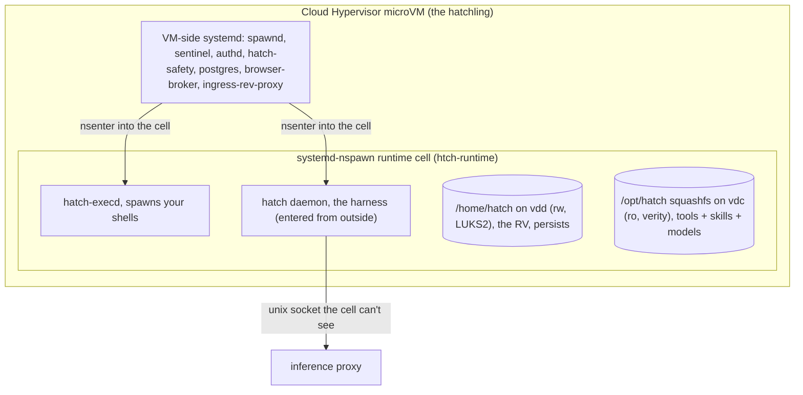

# What's in a Muse?

This is a follow up to a post on [on agent sandboxes](https://rohanadwankar.github.io/posts/platforms.html).

Last time as one commentator wrote (its firecracker all the way down)[https://news.ycombinator.com/item?id=49605644#:~:text=It%27s%20always%2C%20firecracker%20all%20the%20way%20down!], but lucky for us a day later Meta launched Muse to give us a new VM to explore!

As part of the launch one of the bold claims was that Muse is the faster alternative to some of their competition which was covered last time. So lets look under the hood and see what they have been up to. Like last time we will do this by dialing a shell out through [ws-term](https://github.com/RohanAdwankar/ws-term) and looking around with the usual tools.

Right of the bat the first thing you notice is that `systemd-detect-virt` and the DMI table
disagree about what kind of machine this is, and both are right:

```
$ systemd-detect-virt
systemd-nspawn
$ cat /sys/class/dmi/id/product_name
cloud-hypervisor
$ uname -r
7.0.0-26-generic                    # a stock Ubuntu kernel, not a custom build
$ hostname; id; nproc; free -h | grep Mem
htch-runtime
uid=0(root) gid=0(root) groups=0(root)
2
Mem:  7.7Gi  2.1Gi ...
```

So the shell is root inside a **systemd-nspawn container**, and that container is
running inside a VM whose DMI vendor, product, and BIOS strings all read [Cloud
Hypervisor](https://github.com/cloud-hypervisor/cloud-hypervisor). The container shares the VM's kernel, which is why it's a plain
Ubuntu `-generic` kernel rather than the `-fc-` custom build Claude Code boots.

Nothing on the box calls itself Muse in a path. The daemon is `hatch`, the env vars are
`JARVIS_*`, the VM is a "hatchling," the bootstrap cert is the "yolk," the domain is
`metaaivm.com` and its DNS edge is `metaclaw`. The product name shows up in what the
runtime ships: `PROACTIVE_PREFERENCES.md` in the home directory says "Muse reads this
whole file before composing the day's edition," the skills tree has `muse_db` and
`muse-feedback`, and the image carries `models/ultra_muse_1000`. Meta's own
[security post](https://research.meta.ai/blog/security-and-safety-for-ai-agents-our-approach-with-muse)
confirms it: "Muse (codebase name: Hatch)." I'll come back to that post at the end,
because it turns out to describe this box quite precisely.

## Not Firecracker

```
$ cat /sys/class/dmi/id/sys_vendor /sys/class/dmi/id/product_name /sys/class/dmi/id/bios_version
Cloud Hypervisor
cloud-hypervisor
0
$ cat /proc/cmdline
console=ttyS0 root=/dev/vda rootfstype=btrfs ip=dhcp ds=nocloud;s=http://169.254.169.254/latest/
  lsm=landlock,lockdown,yama,integrity,apparmor,bpf ro
  systemd.set_credential=vmm.notify_socket:vsock-stream:2:512
```

Cloud Hypervisor and Firecracker are siblings: both Rust VMMs on KVM built on the same
`rust-vmm` crates. Firecracker came out of AWS Lambda and is deliberately tiny;
Cloud Hypervisor came out of Intel, now lives at the Linux Foundation, and is the
"grown-up" one. The differences that matter for a product like this:

| | Firecracker | Cloud Hypervisor |
|---|---|---|
| Origin | AWS (Lambda, Fargate) | Intel, now Linux Foundation |
| Bus | virtio over MMIO only, `pci=off` | Full PCI, virtio-pci |
| SMBIOS/DMI | none (empty `product_name`) | present, vendor string "Cloud Hypervisor" |
| Hotplug | no | vCPU, memory, disk, NIC hotplug |
| Devices | block, net, vsock, balloon | + vhost-user, virtio-fs, virtio-pmem, TPM, GPU passthrough |
| Balloon | inflate/deflate only | + free-page reporting (guest returns freed memory automatically) |
| Boot | direct kernel only | direct kernel or firmware (UEFI/OVMF) |
| Snapshot/restore | yes | yes |
| Sandbox | its own `jailer` | seccomp, expects an external sandbox |

Muse uses the right column: the guest has four virtio-block disks it can swap, a
vsock notify channel back to the VMM, a balloon with free-page reporting, and later a
*browser VM* that gets leased in per task. Both E2B and Claude Code showed the
Firecracker signature last time (`pci=off`, empty DMI, `virtio_mmio.device=`). This one
has a PCI bus and a BIOS string.

```
$ for d in /sys/bus/virtio/devices/*; do echo "$(basename $d) $(cat $d/device) $(basename $(readlink $d/driver))"; done
virtio0 0x0002 virtio_blk     virtio3 0x0001 virtio_net    virtio5 0x0013 vmw_vsock_virtio_transport
virtio1 0x0002 virtio_blk     virtio4 0x0004 virtio_rng    virtio6 0x0005 virtio_balloon
virtio2 0x0002 virtio_blk     virtio7 0x0002 virtio_blk
$ cat /sys/bus/virtio/devices/virtio6/features | cut -c1-6
011001                          # stats_vq, deflate_on_oom, and bit 5: free page REPORTING
```

That last bit is how a per-user VM that stays up is affordable: the guest hands freed
pages back to the host as it frees them, so an idle hatchling costs its ~2 GB working
set rather than its 8 GB allocation, and two vCPUs at `load average: 0.00` on a
126-core EPYC cost nothing.

## The two boxes

```
$ lsblk -o NAME,SIZE
vda    7.3G       # VM root, btrfs, read-only (ro on the cmdline)
vdb    7.5G       # overlay upper: the writable scratch layer for /
vdc    587M       # the "hatch image": daemon, tools, models, squashfs + verity
vdd    100G       # yours: the RV, btrfs, mounted at /home/hatch
$ df -h | grep -vE tmpfs
overlay         7.5G   17M  7.5G   1% /
/dev/mapper/rv  100G  111M   99G   1% /home/hatch
```

The container has no `/dev/mapper`, but `/sys/block` still lists the device-mapper
targets with their UUIDs, and the UUID prefix tells you what each one is:

```
$ for d in /sys/block/dm-*; do echo "$(cat $d/dm/name) $(cat $d/dm/uuid)"; done
root_overlay  CRYPT-PLAIN-root_overlay              # vdb: dm-crypt plain mode, a throwaway key
opt_hatch     CRYPT-VERITY-0000...-opt_hatch        # vdc: dm-verity, integrity-checked, not secret
rv            CRYPT-LUKS2-5b3a29f5...-rv            # vdd: LUKS2. Your volume is encrypted at rest
```

So the tools image is measured (verity), the scratch layer is encrypted with a key
nobody keeps, and the RV, which one script expands as "Reliable Volume," is a real
LUKS2 volume holding `/home/hatch`, `/var/lib/hatch`, and the Postgres data directory.
The split is the same idea as Claude Code's *yours vs theirs* disks, but with a
container drawn around it:



The VM-side services and the cell share a PID namespace but not a mount namespace.
`hatch daemon` and `hatch-execd` show up in `ps` inside the cell with **PPID 0**: they
were started on the VM and `nsenter`ed in. Even as cell root you cannot read
`/proc/<daemon>/ns/*` or `/proc/<daemon>/root`. That's the same trick as Claude Code's
sealed `process_api`, except the operator process lives *next to* your tenant
namespace instead of being PID 1 of it.

```
$ ps -eo pid,ppid,cmd | head -5
    1     0 /usr/lib/systemd/systemd
   17     1 /usr/lib/systemd/systemd-journald
 1347     0 /opt/hatch/bin/hatch-execd --runtime-cell-leader=1957    # PPID 0: entered from the VM
 1586     0 /opt/hatch/bin/hatch daemon --runtime-cell-leader=1957
$ readlink /proc/1586/ns/mnt
                                                                     # (empty: not yours to see)
$ ls /run/hatch/
auth  cell-anchors  egress-tls  egress-tz  noded  privsep  resume  runtime-cell  sandbox  sandbox-api  telemetry
                                                                     # no proxy/, no daemon/: inference socket is not in the cell's view
```

Root in the cell is uid 131072 on the VM, a user namespace, and the shell you get is
deliberately clipped:

```
$ grep -E 'Seccomp|NoNewPrivs' /proc/self/status
NoNewPrivs:      1
Seccomp:         2
Seccomp_filters: 4
$ python3 -c 'import ctypes,os; l=ctypes.CDLL(None,use_errno=True); l.syscall(425,0,0); print(os.strerror(ctypes.get_errno()))'
Operation not permitted                  # io_uring_setup is filtered
$ capsh --print | grep -o 'Bounding set.*' | grep -cE 'sys_ptrace|net_admin'
0                                        # no CAP_SYS_PTRACE, no CAP_NET_ADMIN, no CAP_NET_RAW, no CAP_SYS_MODULE
```

Even your tool shells are isolated from each other: my bash was in a different mount
namespace from the cell's PID 1. Every `exec` the agent runs gets its own view.

## How it boots

The scripts in `/opt/hatch/runtime-cell/` and `/opt/hatch-image/bin/` are unusually
well commented, and they describe a VM that boots with no owner and gets one attached.

**The VM boots with no identity.** `hatch-prewarm` runs "after hatch-init, before any RV
attach" and describes the cell boot files as *"identityless preboot."* The env carries
`JARVIS_IS_ASSIGNED=0`. Attaching you to a hatchling is `spawnd rv-graft`:

```
rv-graft   Graft RV identity onto the pre-booted runtime: verify the RV binds,
           superficially validate the resume handoff marker, ensure the os-intent
           ledger dir, and write the boot-id-stamped /hatch/data/resume/rv-identity-ready
```

**Nothing is installed at boot.** The VM root is read-only btrfs built with mkosi;
`/opt/hatch` is squashfs on dm-verity (the prewarm script calls it the "measured
rootfs"); the cell's rootfs is reconciled against a KDL manifest (`runtime-cell.kdl`:
~110 apt packages, from `build-essential` to `libreoffice-*-nogui`, `tigervnc`, `xvfb`,
`cloudflared`, `nodejs 24`), and the distro's own `apt-daily`/`unattended-upgrades`
timers are *retired* with inert unit overrides so nothing phones home unattributed.
Packages the agent installs are recorded as intent in an append-only ledger on the RV
and replayed, not persisted in the rootfs.

**The page cache is pre-warmed.** Before the RV attaches, `vmtouch -t` touches the
Postgres server and its `ldd` closure, the hatch daemon binary, `systemd-nspawn`'s
closure, and the cell's init/loader/libc, under a 256 MiB budget with a 10 s
self-deadline, "fail-open everywhere." A health gate requires `is-system-running` to
be exactly `running` before a VM is eligible, so nothing in this path may fail a unit.

**The cell's boot target is nearly empty.**

```
$ systemctl list-units --type=service --state=running
  systemd-journald.service          # that's it
$ systemd-analyze
Startup finished in 2.212s (userspace)
default.target reached after 213ms in userspace
```

`default.target` is a custom unit whose only `Wants=` is `hatch-execd.socket`.
Everything else (Postgres, Sentinel, authd, safety, telemetry, the browser broker)
lives on the VM side and is bind-mounted in as Unix sockets.

**The harness ships separately from the OS.** `hatch --version` printed a commit built
at `2026-09-11T02:29:54Z`, about two hours before I read it, on
`JARVIS_CD_CHANNEL=alpha`. The daemon is a "live-update bundle" with its own trust root
(the prewarm script refuses to `ldd` it for that reason), so a new harness does not
mean a new VM image.

### Watching a rollout

Three times during the evening my shell dropped, the redial loop reconnected, and the
box had a different boot time and a different harness build:

```
$ grep btime /proc/stat; hatch --version
btime 1789094439   hatch 0.1.0 (17400c3e011)  built 02:29:54Z     # 19:40, the VM I started on
btime 1789100040   hatch 0.1.0 (17400c3e011)                       # 21:14
btime 1789102110   hatch 0.1.0 (5d489a6707a)  built 03:11:58Z     # 21:48
btime 1789105122   hatch 0.1.0 (052113f66d3)  built 03:38:10Z     # 22:38
$ journalctl | grep "Startup finished"
Sep 10 21:14:13 htch-runtime systemd[1]: Startup finished in 2.307s.
$ cat /run/hatch/resume/rv-identity-ready; cat /run/hatch/resume/execution-ready.marker
6c7da3cc-... 2026-09-11T04:14:21.732Z marker=present
2026-09-11T04:14:39.110151343+00:00
```

| Stage | Wall clock | Since kernel boot |
|---|---|---|
| Kernel boot (`btime`) | 21:14:00 | 0 s |
| Cell `default.target` | 21:14:13 | 13 s |
| RV grafted, identity known | 21:14:21 | 21 s |
| Second CA refresh (identity-specific anchors published) | 21:14:35 | 35 s |
| `execution-ready` marker | 21:14:39 | 39 s |

That's the deploy mechanism: a new build on the channel means a fresh hatchling with
the new bundle, graft the RV, tear down the old one, ~40 s of outage. My home directory
came back with every file intact and the same timestamps each time, because none of it
lived on the VM. `/usr/sbin/reboot` is overwritten with a script that says the same
thing in the other direction:

```
# A hatchling cannot reboot in place. The VMM does not survive a guest reset:
# the VM disappears, the hatchling goes UNHEALTHY, and the workflow recovers by
# REPLACING it with a brand new VM. That was measured, not assumed ...
# So `reboot` already means "replace this VM" ... Powering off reaches the same
# end state with services stopped in order.
```

The daemon's telemetry fields track it as such (`rollout_id`, `release_id`,
`previous_build_id`, `target_build_id`, `outage_duration_ms`, `pre_deploy_all_healthy`)
and a whole family of `hatch_mount_to_ws_ready_*` metrics (`postgresql_startup`,
`db_preflight`, `runtime_cell`, `daemon_active_to_ws_ready`, `readiness_bottleneck`)
covers the graft-to-ready window in the table above.

## Who manages the lifecycle

The binaries contain the interface the VM presents to whatever runs it, and from inside it looks
like this:

- **Metadata at boot.** The kernel cmdline points cloud-init's `nocloud` datasource at
  `169.254.169.254`, served by the VMM host; that's where per-VM identity, channel, and
  region (`JARVIS_VM_COMPUTE_REGION=scu`) arrive.
- **Readiness over vsock.** `vmm.notify_socket:vsock-stream:2:512` makes systemd's
  `sd_notify` go straight to the VMM, and the prewarm comments say the control plane's
  "health gate requires exactly `running`."
- **Health from inside.** `hatch-healthd` polls the daemon's `/health` on a metrics
  socket "so host-side healthd can dial it without going through the runtime cell's
  IPv6 veth."
- **Rescue.** `hatch-rescue` has `restart-component`, `emit-flare`, and, my favourite,
  `emit-codex-session`: it spawns a `codex app-server` in a "rescue codex home" to
  diagnose a `kernel_incident`. That's what the 258 MB OpenAI Codex CLI in
  `/opt/hatch-image/bin/` is for. The VM's on-call is an agent.
- **Replacement.** The reboot script calls it "the workflow," and the daemon posts to
  `/v1/runtime-events` and `/v1/leased-vm-resources-events` with `host_region` and
  `git_sha`.

## What is metaaivm.com?

Every hatchling has a public name:

```
JARVIS_FQDN=70f9aa6e-1767-497b-96fd-6bbac24fe79b.metaaivm.com
$ dig +short 70f9aa6e-....metaaivm.com
edge-metaclaw.c10r.facebook.com.
57.144.221.192
$ host 57.144.221.192
... edge-metaclaw-shv-01-sjc6.facebook.com.     # a Meta PoP in San Jose, closest to me
$ whois metaaivm.com | grep -E 'Creation|Name Server' | head -2
Creation Date: 2026-02-26
Name Server: A.NS.FACEBOOK.COM
```

The per-VM hostname is a CNAME into Meta's edge (`c10r` is their edge tier; the domain
was registered this February). Behind it, *inside the VM*, is `ingress-rev-proxy`, an
"Internet-facing ingress reverse proxy with Noise_XX encryption": `:443` for infra
(`health`, `version`, `journal`, `rescue`, `yolk`) and `:4431` for the public data
plane (`ping`, `v1/noise`, `spaces`). From my laptop, 443 accepts the TCP connection and
then resets the TLS ClientHello, and 4431 isn't exposed at the edge at all. Without the
Noise handshake the edge has nothing to forward.

This is the biggest architectural difference from last time. Claude Code's VM has
**no inbound at all**; Instinct's E2B box is only reachable by the backend. Muse's VM
is a **server with a DNS name**. The phone app holds a persistent Noise session to your
VM through Meta's edge, and `spaces` (a route on the public listener, with a
`space.json` build format in the daemon's strings and four `space-*.sock` sandboxes in
`/run/hatch/sandbox/`) are web apps the agent builds and serves *from your VM*.

The persistent session is also why the app feels the way it does. The "responding"
bubble appears the instant you hit send because the daemon's admission step is a few
writes to local Postgres and the typing indicator fires there, before prompt assembly
and long before a model token. The daemon instruments the whole path
(`ingress_ms`, `admission_ms`, `pre_inference_prompt_assembly_*_ms`, `time_to_llm_ms`,
`time_to_first_response_token_ms`, `tokens_per_second`), and nothing in it is a VM
waking up.


## Egress: fake IPs and a MITM

The cell has one veth with a /30 and a gateway that is also the DNS server and the
proxy:

```
$ ip -br a
host0@if3  UP  198.19.0.2/30  fd8b:4f84:7d32:99::2/64
$ grep -v '^#' /etc/hosts | tail -2
198.19.0.1 hatch-egress-proxy
fd8b:4f84:7d32:99::1 hatch-egress-proxy
$ env | grep -i proxy
HTTPS_PROXY=http://hatch-runtime:<rotated-per-boot>@hatch-egress-proxy:3128
NO_PROXY=localhost,127.0.0.1,::1,198.19.0.1,198.19.0.2,...
CURL_CA_BUNDLE=/run/hatch/egress-tls/ca-bundle.pem      # also GIT_SSL_CAINFO, NODE_EXTRA_CA_CERTS, AWS_CA_BUNDLE
```

What happens when you try to get around it:

```
$ dig +short @8.8.8.8 example.com
198.18.123.158                       # not example.com: a fake IP from the 198.18/15 bench range
$ curl https://1.1.1.1/              # direct 443, no proxy
curl: (35) ... SSL connect error     # TCP is answered, TLS is not: the gate ate it
$ curl -sv https://example.com/ 2>&1 | grep -E 'issuer|Connection Established'
< HTTP/1.1 200 Connection Established
*  issuer: CN=Hatch Sandbox Egress CA; O=Hatch          # MITM'd, like Claude Code's egress gateway
$ curl https://example.com:8443/     # non-standard port
< HTTP/1.1 200 Connection Established
curl: (28) Operation timed out       # CONNECT accepted, then held
```

DNS is answered by the gateway with synthetic addresses so that every connection can
be attributed to a *name* at the proxy, and the `pre-start.sh` script attaches an
eBPF `connect4`/`connect6` cgroup hook (`spawnd attach-cell-gate`) as "the floor UNDER
Sentinel: with `BPF_F_ALLOW_MULTI`-composed cgroup hooks every program must allow, so a
dead/held-down Sentinel no longer means ungoverned link-local/RFC1918/CGNAT reach."
There's a second classifier on the VM side of the veth that drops frames aimed at
host-local destinations.

Sentinel is the policy engine, and the runtime-cell manifest spells out how it
decides, in a comment explaining why the distro's own apt timers were disabled:

```
# ... their egress reaches Sentinel unattributed ... and fleet-wide HITL prompt
# storms whenever they dial a host the managed system-egress allowlist does not
# carry (the 2026-08-15 cli.github.com storm).
```

So the policy is per **host**: a managed allowlist (`managed-internal-network-policies.yaml`
is named as the file), and a human-in-the-loop prompt for anything off it. Unattributed
traffic, meaning a process Sentinel can't tie to a cell cgroup, is what the eBPF gate
is there to stop. The proxy password and the CA bundle both rotate on every VM
replacement, and a `hatch-ca-trust.path` unit watches for rotation. The one thing the
box never sees is an inference endpoint: `api.anthropic.com` returned a 404 through the
proxy, reachable but keyless, and the daemon's inference socket isn't mounted in the
cell.

### How an approval reaches your phone

The daemon binary carries the whole approval path in its symbol names:

```
$ strings /opt/hatch/bin/hatch | grep -oiE '[a-z_./]*(hitl|approval|push_notif)[a-z_./]*' | sort | uniq -c | sort -rn | head
  119 egress_approval_runtime
   51 push_notifications.rs
    9 approval_decision_forward.rs
      /crates/hatch-agent/src/agent_manager/control/agent_lifecycle/approval_terminalization
      /crates/hatch-agent/src/session/impl_session/message_execution/tool_dispatch_batch/approval_intent
      //localhost/hatch/send_push_notification
      //notifications/approval-refresh/     //notifications/missed-chat/
      /approval-sync   hitl_fetch_approvals   hitl_decisions   channel_hitl_decision_terminal
      approval_id approval_lifecycle_phase approval_attention_mode approval_delivery_mode
      hitl_governing_surface hitl_configured_enabled hitl_effective_enabled hitl_snoozed hitl_scope
      connect_mitm_eligibility matched_network_grant_id mase_outcome hitl_never_resolved
```

Read in order:

1. **Sentinel** (VM side) classifies the CONNECT (`connect_classification`,
   `connect_mitm_eligibility`, `mase_outcome` against the `mase_*` blocklist shipped in
   `/home/hatch/assets/blocklist/`) and either matches an existing grant
   (`matched_network_grant_id`) or holds the connection and emits an event on
   `egress-approvals-events.sock`.
2. **The daemon's `egress_approval_runtime`** registers it (`approval_registration`,
   `approval_delivery_mode`) and checks whether HITL applies right now
   (`hitl_configured_enabled`, `hitl_effective_enabled`, `hitl_snoozed`, `hitl_scope`,
   `hitl_governing_surface`). Tool calls that will need consent are flagged earlier, at
   `tool_dispatch_batch/approval_intent`.
3. **Push.** The daemon POSTs to `localhost/hatch/send_push_notification`, a local
   endpoint that fronts the backend, and the phone receives a
   `notifications/approval-refresh/` push.
4. **Fetch and decide.** The app pulls pending approvals over the Noise session
   (`hitl_fetch_approvals`) and posts `hitl_decisions` back the same way, or through a
   messaging channel (`channel_hitl_decision_terminal` exists for WhatsApp/Telegram-style
   surfaces).
5. **Forward.** `approval_decision_forward.rs` relays the decision to Sentinel over
   `egress-approvals-admin.sock`, the held CONNECT is released or reset, and the
   approval is "terminalized" (`approval_terminalization`; `hitl_never_resolved` is the
   timeout state my 8443 test landed in).

Purchases go through the same machinery with `approval_type=checkout_provider`, and the
Shopify skill comments note "the purchase HITL is new spend ... Shopify completion
itself must not prompt again." One queue shared by network egress, browser actions
(`hatch_safety_enable_browser_classifier_hitl`), and money.

## Inside the harness

The harness is  one 327 MB Rust binary (similar size to Claude Code's Bun
harness was 324 MB), and the Cargo registry paths baked
into it are the dependency list:

```
$ strings hatch | grep -oE 'index\.crates\.io-[a-f0-9]+/[a-zA-Z0-9_-]+-[0-9]' | sed 's/.*\///; s/-[0-9]$//' | sort | uniq -c | sort -rn
tokio hyper axum tokio-tungstenite reqwest rustls h2         # async runtime, HTTP, WebSocket
sqlx-postgres sqlx-sqlite sqlparser                          # Postgres client, and a SQL parser for muse.db
genai                                                        # multi-provider LLM client (rust-genai)
ort fastembed tokenizers hf-hub ndarray                      # ONNX runtime: the local classifiers + embeddings
boa_engine boa_parser                                        # a JavaScript engine, in Rust
seccompiler                                                  # builds the seccomp filters your shell runs under
tree-sitter scraper html5ever lopdf calamine image           # parsing code, HTML, PDF, xlsx, images
jsonschema schemars moka prometheus tracing-subscriber
$ strings hatch | grep -ciE 'langgraph|langchain|rmcp|modelcontextprotocol'
0
```

The one open-source agent-ish component is `genai`, a provider-agnostic Rust LLM
client, which is how one binary talks to several model families behind a single
interface:

```
$ strings /opt/hatch/bin/hatch | grep -oE '(claude|avocado|gpt)-[a-z0-9.-]+' | sort | uniq -c | sort -rn | head
  3 avocado-5.16-v4          # internal model family, also "avocado-memory-flush-v1"
  2 claude-opus-4-6
  2 claude-opus-4-8
  1 claude-sonnet-4-6
  1 gpt-5.6-sol
  1 gpt-5.5-codex
$ strings /opt/hatch/bin/hatch | grep -c anthropic     # "failed to parse anthropic response", "/v1/messages"
```

The transport is Meta's internal gateway, which the code calls **ipnext**
(`ipnext/stream.rs`, `ipnext/avocado-5.16-v4`, `ipnext/proxy_readiness.rs`), and
`JARVIS_ANTHROPIC_TIMEOUT_MS` / `JARVIS_AVOCADO_CONTEXT_WINDOW_TOKENS` are separate
knobs, so the providers are first-class rather than hidden behind a router. Inference
leaves the daemon over `JARVIS_INFERENCE_PROXY_SOCK`, a Unix socket the cell cannot
reach, so which model answers is a server-side decision. Meta's post names the
headline model as **Muse Spark 1.3**; `avocado` is presumably its codename.

It is an agentic loop, and the symbol names lay out its stages:

```
admission → pre_inference (skill_loading, prompt_assembly, context_pressure, compaction)
          → model stream (ipnext / anthropic /v1/messages / openai responses)
          → tool_dispatch_batch (+ approval_intent)
          → post_tool_continuation → post_inference_terminalization
agent_loop(49)  message_execution(210)  objective_worker(258)  subagent_spawns(248)  compaction(152)
```

**Compaction** is eager and runs in the background (`started_eager_background_compaction`,
`adopted_eager_background_compaction`), so the context summary is ready before the
window fills, and it has its own model (`avocado-memory-flush-v1`). **Objective
workers** are long-running goals with their own dispatch and "notification steps,"
which is what powers the proactive feed editions. **Sub-agents** are first-class
(`subagent_spawns`, `subagent_monitor`, the `SUBAGENTS_MONITORING.md` policy file in
your home directory) and each one gets its own transcript under
`agents/agent-<uuid>/sessions/`. Every stage has a timeout env var
(`JARVIS_TOOL_DISPATCH_TIMEOUT_MS`, `JARVIS_MODEL_STREAM_FIRST_CHUNK_TIMEOUT_MS`,
`JARVIS_POST_INFERENCE_TERMINALIZATION_TIMEOUT_MS` ...) and a restart checkpoint in
Postgres, which is how a session survives the VM being replaced mid-turn.

One super cool feature to see is there are sidecar classifiers, a lot of them:

```
$ strings hatch | grep -oE '[a-z0-9_]*(classifier|prefilter|gatekeeper|judge|guard)[a-z0-9_]*' | sort | uniq -c | sort -rn | head
  198 judge             75 guard              70 classifier         45 gatekeeper
   27 safety_classifiers   13 policyguard     12 prefilter          11 visual_browser_screenshot_guard
    8 cbrne_returned_text_guard   8 browser_action_guard   7 phone_call_judge
```

The named models: `9b_safety_classifier`, `2b_tool_call_classifier_v0_4`,
`pi_3b_prefilter` (a prompt-injection prefilter; there's also an "ORIGIN GATE" prompt
that classifies which *source* of text could carry an injection, and
`JARVIS_EXTERNAL_CONTENT_BOUNDARIES_ENABLED`). Some run on-box through `ort`, the rest
behind the `hatch-safety` socket on the VM side. A separate `/alignment/system/steps/`
pipeline (`judge`, `reflect`, `repair`, `distill`, `generalize`) and a
`self_improvement` schema in Postgres grade and rewrite the agent's own behaviour
offline, and `JARVIS_DEFAULT_MAX_TRAINING_TIER` reads like a per-user consent level for
what can be used as training data.

Some models are on the box too:

```
$ ls /opt/hatch-image/models/
asr/       faster-whisper-tiny                          # local speech-to-text
memory/    models--Qdrant--all-MiniLM-L6-v2-onnx        # 91 MB embedding
           models--jinaai--jina-reranker-v1-turbo-en    # 153 MB reranker
$ ls /opt/hatch-image/bin/
bun  codex  rtc-sidecar  hatch-manifest  hatch-prewarm  ...
$ /opt/hatch-image/bin/codex --version
codex-cli 0.149.0                                        # OpenAI's Codex CLI, 258 MB, used by hatch-rescue
```

## Memory: Postgres

Memory is not a git repo of Markdown like Instinct. It's on-VM **Postgres**, and the
`muse_db` skill ships the whole schema as a 4,116-line reference so the agent can
query it through a bounded read-only `SELECT` surface:

```
$ grep -c '^#### ' /opt/hatch/skills/muse_db/references/schema.md
194                                   # tables
$ grep '^### ' schema.md | tr '\n' ' '
activity agent device feed goals health ideas ingest media memory messages podcasts
runtime scheduler self_improvement shell spaces
$ grep '^#### `memory\.' schema.md
memory.claims  memory.entries  memory.entry_attributes  memory.embeddings
memory.embedding_models  memory.metadata
```

`memory.entries` is chunked text keyed by a `memory_uri`, `memory.embeddings` holds the
vectors from the on-box MiniLM model, and the jina reranker sorts hits at query time.
The `device.*` schema is your phone synced in (contacts, call log, calendar events,
upload sessions), `agent.*` is transcripts, compactions, and sub-agent progress, and
the schema notes say reasoning columns are served through a redacted projection.

It is a real server per VM, not a shared one somewhere else:

```
$ grep -i pgsql /proc/net/unix | head -1        # net namespace is shared with the VM
... /run/hatch/postgres/.s.PGSQL.5432
$ ls -ld /var/lib/hatch/postgres
d---------  nobody nogroup  /var/lib/hatch/postgres   # data dir on the RV, mode 000 to the cell
$ find / -xdev -name .git 2>/dev/null
/home/hatch/workspace/wsterm/.git                # the only git repo on the box is mine
```

The server binary lives at `/opt/metasql` on the VM root (the prewarm script names it
as a "whole-fat-binary" it refuses to page in), the data directory rides the LUKS2 RV,
and the daemon talks to it over the Unix socket with a connection pool
(`postgres/pool.rs`, `postgres/write_retry.rs`). The credential is only handed out to
"trusted Hatch database callers": `hatch-doctor run` from my shell got a 403 from
`authd`, which authenticates callers by `SO_PEERCRED` uid *and* cgroup. Backups are
btrfs: `spawnd` and the daemon both carry `btrfs snapshot` / `subvolume snapshot` /
`backup_path` strings, which matches Meta's "your VM data is backed up continuously."

The agent's own files is very familiar to those who have seen other 2026 assistants, an
[OpenClaw](https://github.com/openclaw/openclaw)-style workspace:

```
root@htch-runtime:~# ls /home/hatch/
AGENTS.md                 USER.md   hooks
HEARTBEAT.md              agents    memory
IDENTITY.md               assets    prompts
MEMORY.md                 channels  runtime.lock
PROACTIVE_PREFERENCES.md  config    subscriptions
SOUL.md                   data      user
SUBAGENTS_MONITORING.md   docs      workspace
TOOLS.md                  dreams
root@htch-runtime:~#

```
Here we can also see the design which imbraces subagents goals and cron jobs
```
PROACTIVE_PREFERENCES.md      # "Muse reads this whole file before composing the day's edition"
agents/agent-<uuid>/sessions/<uuid>.jsonl     # 18 sub-agents so far, transcripts as JSONL
workspace/cron.d/{secondly,minutely,hourly,daily,weekly,monthly,yearly,runonce}
workspace/goals/<slug>/{GOAL.md,briefs,crons,agent_notes,files,references}
workspace/feed/  workspace/scheduler/
```


## Tools: 70 CLIs, 60 sandboxes, one browser broker

```
$ ls /opt/hatch/bin | wc -l
70
$ ls /opt/hatch/bin | head -40 | tr '\n' ' '
authdc browser-broker browser-service calendly device-data duffel facebook-cli ... hatch-vault
hatch-ws-client hatch-zeitgeist healthkit-cli instagram-cli ... outlook-mail peloton philips-hue
places plaid printify ... spotify-api stripe-link tailscale tessie-api threads-cli ticketmaster tts ...
$ ls /run/hatch/privsep | wc -l
60
```

Like Instinct, tools are CLIs rather than MCP servers. Unlike Instinct, they run *on
the box*, but each one runs as its own **privsep worker**: `spawnd
ensure-worker-accounts` creates a `hatch-w-<tool>` uid per tool, gives it an id-mapped
view of its state directory, and the cell reaches it only through
`/run/hatch/privsep/<tool>.sock`. Most binaries in `/opt/hatch/bin` are symlinks to one
`hatch-multicall` binary that refuses to run under its own name. Two config files
gate which tools and skills a VM even *sees* by CD channel:

```
$ cat /opt/hatch/runtime-cell/skill-scopes.conf | grep -v '^#'
hatch-e2e ads_mcp health nutrition
internal-test ads_mcp audio_notes_read documents end-call health nutrition polymarket price-tracker
prod whatsapp
```

Gated skills are staged host-only and overlaid into `/opt/hatch/skills` at cell launch
"fail-closed"; an unknown channel reveals nothing.

Credentials never reach the cell. `authdc --help` describes `hatch-authd` as the thing
that "operates on auth-files" and "dynamic credentials," gated by peer credentials, and
Meta's [post](https://research.meta.ai/blog/security-and-safety-for-ai-agents-our-approach-with-muse) says what those dynamic credentials are: surrogate tokens, so "the agent
never sees real tokens." Purchases get the same treatment through Stripe Link: there's
a `stripe-link-checkout-card` privsep socket and a `checkout-spend.sock` on the VM
side, and the post explains that a single-use card number is issued "tied to that
particular merchant, a particular dollar amount, and only valid for a limited period."

The browser is the same lesson Instinct taught: don't keep it in the sandbox.

```
$ browser-broker --help | head -3
Long-running broker daemon that routes browser sessions to leased VMVM browsers
  --socket    ... that subdir is DELIBERATELY not bind-mounted into the runtime cell:
              the cell has NO path to the broker. The sole client is the host daemon ...
              the in-cell→broker bind remains absent to close the HiTL-consent bypass
```

A "VMVM" is a browser VM leased per task (15-minute TTL), routed by a broker that only
the daemon can talk to, so a tool the agent runs in the cell can't drive a logged-in
browser without going through the consent flow. The sub-agent driving it gets an
accessibility-tree snapshot rather than the DOM, with no script execution and DevTools
disabled (`visual_browser_screenshot_guard` and `browser_action_guard` are the
classifiers watching it). `/opt/meta-chromium` is also shipped in-cell for headless
work that doesn't need your cookies.

The lease itself is brokered by something called **Stefi**. There's a
`JARVIS_STEFI_PROXY_SOCK` next to the inference socket, and the daemon's strings show
what goes through it:

```
$ strings /opt/hatch/bin/hatch | grep -i stefi
hatch-engine/crates/hatch-browser-lease/src/stefi.rs
stefi_create stefi_status stefi_renew stefi_release        # browser VM leases
(Stefi `consent_uri`, return_uri-stamped) resolved by the auth-status   # connector OAuth
STEFI WhatsApp cursor conflict:                             # WhatsApp channel pairing
parse Stefi onboarding avatars:                             # onboarding assets
Opaque monotonic Stefi version. Compare only; do not display as a count.
```

So `stefi-proxy` is the VM's one door into Meta's control plane: anything that needs a
backend decision (lease a VM, link an account, pair a messaging channel, send a push)
goes out through that socket, and the cell has no path to it either.

## Inputs and outputs

The cleanest inventory of what goes in and out of the box is the list of Unix socket
paths compiled into the daemon. Every one is a bind-mount from the VM side, and the
cell sees only the handful it needs:

```
$ strings hatch | grep -oE '/run/hatch/[a-z0-9_./-]+\.sock' | sort -u
/run/hatch/daemon/http-api.sock            realtime-protocol.sock   rtc-stats.sock      # the app, via ingress-rev-proxy
/run/hatch/proxy/inference.sock            # OUT: models, through ipnext
/run/hatch/proxy/stefi.sock                # OUT: Meta control plane (leases, consent, channels, push)
/run/hatch/sentinel/egress-approvals-admin.sock  daemon-egress-approvals.sock  http-api.sock   # egress policy + HITL
/run/hatch/safety/security.sock            # hatch-safety: the classifier ensemble
/run/hatch/auth/authd.sock                 vault-encrypt/encrypt.sock   whatsapp-keyd/keyd.sock  # secrets
/run/hatch/browser-broker/browser-broker.sock  research-browserd.sock  daemon/browser-control.sock  # leased browsers
/run/hatch/rtc/realtime.sock               voice-genui-decision.sock   present-widget.sock   # voice calls, live UI
/run/hatch/checkout-spend/checkout-spend.sock  credit-watcher.sock     # money: purchases and the credit meter
/run/hatch/cron-store/control.sock         noded/control.sock  tailscale/control.sock  ssh-access.sock
/run/hatch/telemetry/telemetry.sock        bugreport.sock  daemon/metrics.sock    # OUT: to Meta's logging (scuba)
/run/hatch/sandbox/space-{inference,media,web-search,privileged}.sock  sandbox-api/api.sock  space-share.sock
/run/hatch/exec/execd.sock                 daemon/enter-tool-environment.sock   # IN to the cell: your shell
/run/hatch/privsep/<tool>.sock  x60        # the tool workers
```

## Summary

| | Claude Code | Instinct | Muse |
|---|---|---|---|
| Isolation primitive | Firecracker microVM | Firecracker microVM (E2B) | Cloud Hypervisor microVM **+ nspawn cell** |
| Who runs the fleet | Anthropic | E2B, rented | Meta |
| Guest inside the VM | Custom Rust PID 1 | Full Ubuntu + XFCE | Ubuntu host services + Ubuntu container |
| Boot (measured) | ~6.4 s to harness | ~1.26 s to desktop | 13 s to cell, ~40 s to ready |
| Lifecycle | Reclaim when idle, wake on message | Timeout, cold boot or snapshot resume | Pre-booted hatchling, RV grafted; replaced per rollout; balloon reclaims idle memory |
| What's durable | `vda` block volume | git repo in S3 | `vdd`, a LUKS2-encrypted 100 GB "Reliable Volume" |
| Memory model | Conversation on disk | Markdown vault, git | On-VM Postgres (194 tables) + local embedding/reranker |
| Inbound | none | backend only | **Public FQDN, Noise_XX through Meta's edge** |
| Egress | 443-only MITM gateway | open | MITM proxy + eBPF gate + fake-IP DNS + HITL approvals |
| Harness | On the box, Bun | Off the box | On the box, 327 MB Rust, sealed, entered from the VM side |
| Model | Claude via SSE | never from the box | Server-side routing: `avocado-*`, `claude-*`, `gpt-*` via `genai` |
| Safety sidecars | | | ~10 classifier/judge families, on-box ONNX + `hatch-safety` |
| Tools | MCP / built in | CLI, executed server-side | 70 CLIs, each a privsep uid, browser in a leased VM |

Three products, three answers to "where does the agent live." Claude Code says the VM is
the session. Instinct says the VM is disposable and the git repo is the agent. Muse says
the VM is disposable, *your volume* is the agent, and there should always be a VM
already wearing it.

Every command in this post was run through a reverse shell the agent itself set up,
with secrets (proxy password, ws-term token) redacted.

## PS

If you are interested in sandboxs one other massive piece of news that I'd be remiss not to mention is the launch of the open ai agents sdk using the e2b sandbox 
You may remember E2B from its mention in the last post where the CEO even popped by to answer questions. I'd reccomend checking out their accouncment here https://e2b.dev/resources/e2b-is-now-in-agents-sdk
